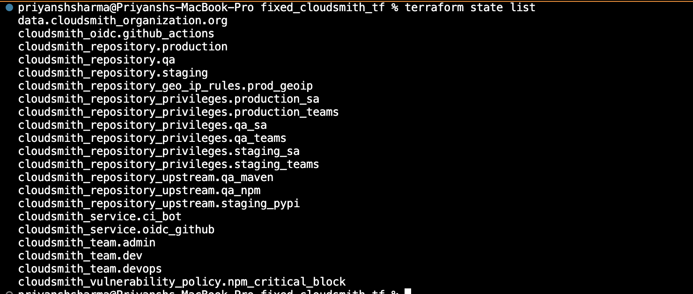

# Cloudsmith Provider

## Task

This page details how I configured the Cloudsmith Terraform provider with the required version, authentication, and organization lookup to be used by other resources (repositories, upstreams, policies, etc.).

### Terraform Example

````
terraform {
  required_providers {
    cloudsmith = {
      source  = "cloudsmith-io/cloudsmith"
      version = "0.0.60"
    }
  }
}

provider "cloudsmith" {
  api_key = var.cloudsmith_api_key
}

# Namespace/org lookup used by most resources
data "cloudsmith_organization" "org" {
  slug = var.organization
}
````

#### Explanation

* **terraform block** → pins the Cloudsmith provider to version `0.0.60`.
* **provider "cloudsmith"** → authenticates using an API key stored in Terraform variables (`var.cloudsmith_api_key`).
* **data "cloudsmith\_organization"** → looks up the Cloudsmith organization namespace using `var.organization`, making it reusable across multiple resources.

My provider and org declaration

````
terraform {
  required_providers {
    cloudsmith = {
      source  = "cloudsmith-io/cloudsmith"
      version = "0.0.60"
    }
  }
}

provider "cloudsmith" {
  api_key = var.cloudsmith_api_key
}

# Namespace/org lookup used by most resources
data "cloudsmith_organization" "org" {
  slug = var.organization
}
````

### Output

#### 1. Terraform init


#### 2. Terraform fmt (format)


#### 3. Terraform validate


#### 4. Terraform apply


#### 5. Terraform state list



#### 6. Terraform state show (example production rep


