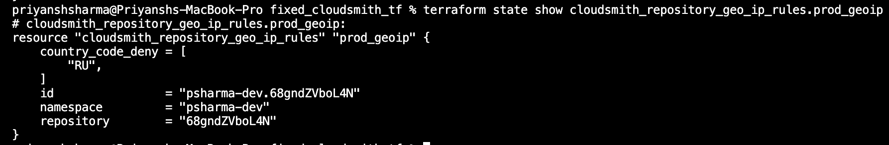

# Cloudsmith Geo IP Rules

## Task
This page details how I used the Cloudsmith Terraform provider to create a Cloudsmith rule CIDR block to block traffic coming from Russia.

### Terraform Example

````
resource "cloudsmith_repository_geo_ip_rules" "my_rules" {
    namespace          = "${data.cloudsmith_organization.my_organization.slug_perm}"
    repository         = "${resource.cloudsmith_repository.my_repository.slug_perm}"
    cidr_allow         = [
      "10.0.0.0/24",
    ]
    country_code_deny  = [
      "CA",
      "WF",
    ]
}
````

#### Geo/IP rule to block all the traffic coming from Russia

````
resource "cloudsmith_repository_geo_ip_rules" "prod_geoip" {
  namespace  = var.organization
  repository = cloudsmith_repository.production.slug_perm

  country_code_deny = ["RU"]
}
````

#### Output


