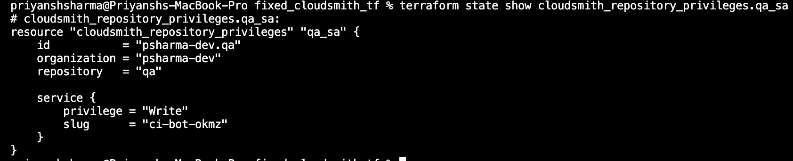

# Cloudsmith Repository Privileges

## Task
This page details how I used the Cloudsmith Terraform provider to manage repository and service account privileges for newly created repositories and service accounts.
Upstreams that were created were:


### Teams Privileges

Repository privileges for teams are configured using the cloudsmith_repository_privileges resource.
Each block assigns Read, Write, or Admin permissions to specific teams on a repository.

#### QA Repository

Dev: Write
DevOps: Write
Admin: Write

````
resource "cloudsmith_repository_privileges" "qa_teams" {
  organization = data.cloudsmith_organization.org.slug
  repository   = cloudsmith_repository.qa.slug

  team {
    slug      = cloudsmith_team.dev.slug
    privilege = "Write"
  }

  team {
    slug      = cloudsmith_team.devops.slug
    privilege = "Write"
  }

  team {
    slug      = cloudsmith_team.admin.slug
    privilege = "Write"
  }
}
````

#### Output


#### Staging Repository

Dev: Write
DevOps: Write
Admin: Write

````
resource "cloudsmith_repository_privileges" "staging_teams" {
  organization = var.organization
  repository   = cloudsmith_repository.staging.slug

  team {
    slug      = cloudsmith_team.dev.slug
    privilege = "Write"
  }

  team {
    slug      = cloudsmith_team.devops.slug
    privilege = "Write"
  }

  team {
    slug      = cloudsmith_team.admin.slug
    privilege = "Write"
  }
}
````

#### Output


#### Production Repository

Admin: Write (or Admin if full admin access is required)
DevOps: Read
Dev: No access

````
resource "cloudsmith_repository_privileges" "production_teams" {
  organization = var.organization
  repository   = cloudsmith_repository.production.slug

  team {
    slug      = cloudsmith_team.admin.slug
    privilege = "Write" # Change to "Admin" if you want full admin
  }

  team {
    slug      = cloudsmith_team.devops.slug
    privilege = "Read"
  }

  # No Dev access to Production
}
````

#### Output


### Service Account Privileges

Repository privileges for service accounts (e.g., CI/CD bots) are also managed with the cloudsmith_repository_privileges resource.


#### QA Repository
CI Bot: Write

````
resource "cloudsmith_repository_privileges" "qa_sa" {
  organization = data.cloudsmith_organization.org.slug
  repository   = cloudsmith_repository.qa.slug

  service {
    slug      = cloudsmith_service.ci_bot.slug
    privilege = "Write"
  }
}
````
#### Output



#### Staging Repository
CI Bot: Write

````
resource "cloudsmith_repository_privileges" "staging_sa" {
  organization = data.cloudsmith_organization.org.slug
  repository   = cloudsmith_repository.staging.slug

  service {
    slug      = cloudsmith_service.ci_bot.slug
    privilege = "Write"
  }
}
````
#### Output


#### Production Repository

CI Bot: Read (or Write if deployments go direct)

````
resource "cloudsmith_repository_privileges" "production_sa" {
  organization = var.organization
  repository   = cloudsmith_repository.production.slug

  service {
    slug      = cloudsmith_service.ci_bot.slug
    privilege = "Read" # or "Write" if deployments go direct
  }
}
````

#### Output


### Summary

#### Teams:

QA & Staging → Dev, DevOps, Admin all have Write access.
Production → Admin has Write (or Admin), DevOps has Read, Dev has no access.

#### Service Accounts:

QA & Staging → CI Bot has Write access.
Production → CI Bot has Read (or Write for direct deployments).
