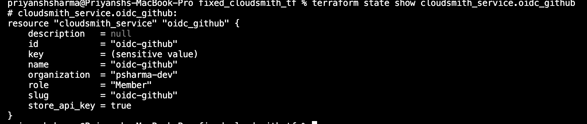

# Cloudsmith Service Account

## Task
This page details how I used the Cloudsmith Terraform provider to create a service account for using it later with OIDC.

### Terraform Example

````
provider "cloudsmith" {
 api_key = "my-api-key"
}

data "cloudsmith_organization" "my_org" {
 slug = "my-organization"
}

resource "cloudsmith_team" "my_team" {
 organization = data.cloudsmith_organization.my_org.slug
 name         = "My Team"
}

resource "cloudsmith_service" "my_service" {
 name         = "My Service"
 organization = data.cloudsmith_organization.my_org.slug

 team {
  slug = cloudsmith_team.my_team.slug
 }
}
````

#### Service account to be used with OIDC

````
resource "cloudsmith_service" "oidc_github" {
  name         = "oidc-github"
  organization = var.organization
}
resource "cloudsmith_oidc" "github_actions" {
  namespace    = data.cloudsmith_organization.org.slug_perm
  name         = "GitHub Actions OIDC"
  enabled      = true
  provider_url = "https://token.actions.githubusercontent.com/"
  service_accounts = [
    cloudsmith_service.oidc_github.slug,
  ]

  claims = {
    repository_owner = "sharmapriyansh-dev"
  }
}
````

#### Output



