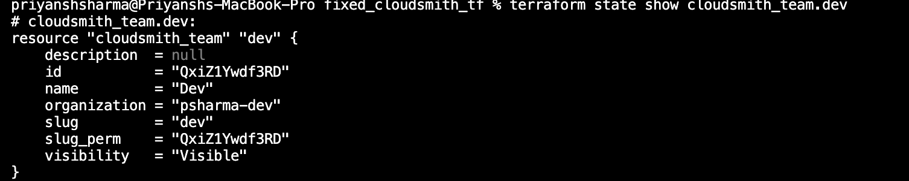
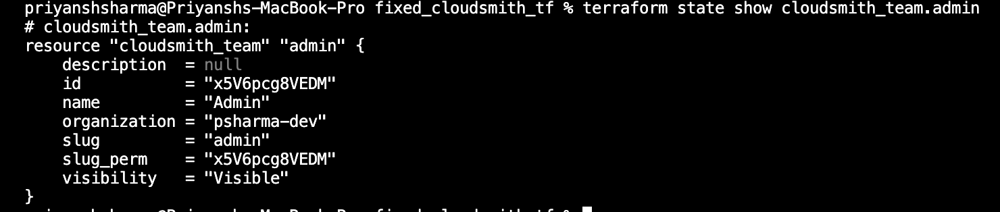
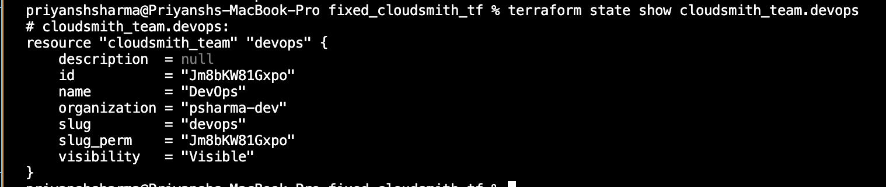

# Cloudsmith Teams

## Task
This page details how I used the Cloudsmith Terraform provider to create teams within the organization and assign roles.  
Outputs are evidenced by corresponding screenshots. Teams that were created were:

- Dev
- DevOps
- Admin

---

### Terraform Example

```
provider "cloudsmith" {
    api_key = "my-api-key"
}

data "cloudsmith_organization" "my_org" {
    slug = "my-organization"
}

resource "cloudsmith_team" "my_team" {
    organization = data.cloudsmith_organization.my_org.slug_perm
    name         = "My Team"
}
```

### Terraform Code Snippet

#### 1. Dev

```
resource "cloudsmith_team" "dev" {
  organization = var.organization
  name         = "Dev"
  slug         = "dev"
}
```

#### Output:




#### 2. Admin

```
resource "cloudsmith_team" "admin" {
  organization = var.organization
  name         = "Admin"
  slug         = "admin"
}
```
#### Output:



#### 3. DevOps

```
resource "cloudsmith_team" "devops" {
  organization = var.organization
  name         = "DevOps"
  slug         = "devops"
}
```
#### Output:


