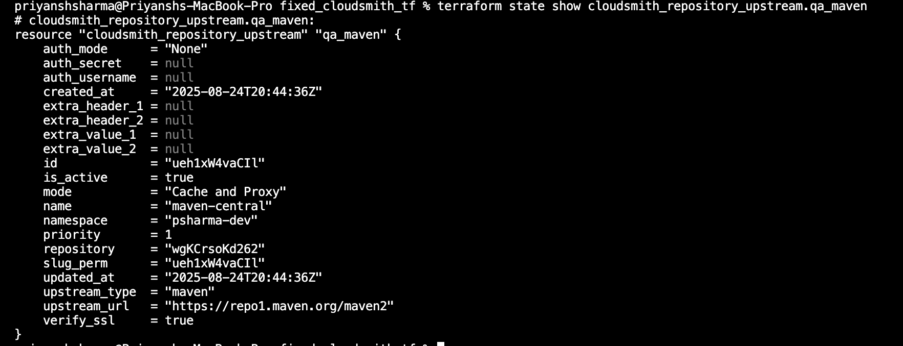
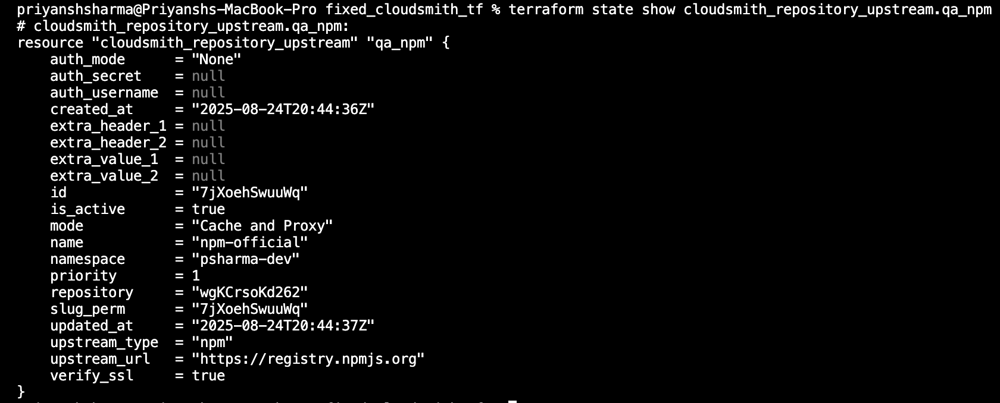

# Cloudsmith Upstreams

## Task
This page details how I used the Cloudsmith Terraform provider for Upstream Proxy operations for repositories created above.
Upstreams that were created were:

- PyPI
- NPM
- Maven

---

### Terraform Example

````
provider "cloudsmith" {
    api_key = "my-api-key"
}

data "cloudsmith_organization" "my_organization" {
    slug = "my-organization"
}

resource "cloudsmith_repository" "my_repository" {
    description = "A certifiably-awesome private package repository"
    name        = "My Repository"
    namespace   = "${data.cloudsmith_organization.my_organization.slug_perm}"
    slug        = "my-repository"
}
````

#### QA: NPM + Maven

````
resource "cloudsmith_repository_upstream" "qa_npm" {
  namespace  = var.organization
  repository = cloudsmith_repository.qa.slug_perm

  name          = "npm-official"
  upstream_type = "npm"
  upstream_url  = "https://registry.npmjs.org"

  mode       = "Cache and Proxy"
  is_active  = true
  verify_ssl = true
}
````

````
resource "cloudsmith_repository_upstream" "qa_maven" {
  namespace  = var.organization
  repository = cloudsmith_repository.qa.slug_perm

  name          = "maven-central"
  upstream_type = "maven"
  upstream_url  = "https://repo1.maven.org/maven2"

  mode       = "Cache and Proxy"
  is_active  = true
  verify_ssl = true
}
````

#### Output




#### Staging: Python (PyPI)

````
resource "cloudsmith_repository_upstream" "staging_pypi" {
  namespace  = var.organization
  repository = cloudsmith_repository.staging.slug_perm

  name          = "pypi-official"
  upstream_type = "python"
  upstream_url  = "https://pypi.org/simple"

  mode       = "Cache and Proxy"
  is_active  = true
  verify_ssl = true
}
````

#### Output

